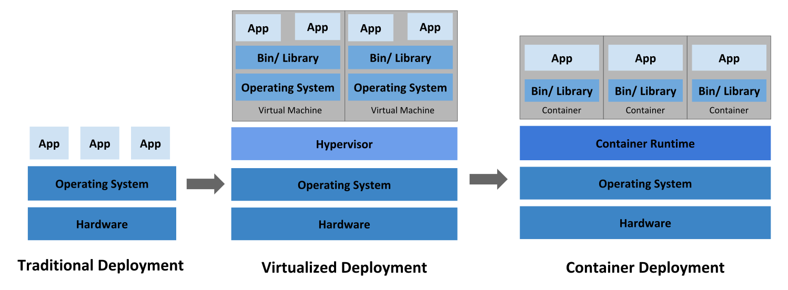

[Index](index.md) >> [Kubernetes](kubernetes.md) >> [Concepts](kubernetes-concepts.md)

Kubernetes is a portable, extensible, open-source platform for managing containerized workloads and services, that facilitates both declarative configuration and automation.

# Going back in time

**Traditional deployment era**

* Applications on physical servers
* Multiple applications on a physical server underperform
* A physical server for an application is underutilized
* Expensive and do not scale

**Virtualized deployment era**

* Multiple virtual machines (VMs) on a single physical server's CPU
* Provides isolation and security for  application between VMs
* Allows better utilization and scalability
* Each VM is a full machine running all the components on top of the virtualized hardware

**Container deployment era**

* Similar to VMs
* Relaxed isolation than VMs due to OS sharing among applications
* Lightweight

**Container benefits**

* Agile application creation and deployment
* Continuous development, integration, and deployment
* Dev and Ops separation of concerns
* Observability not only surfaces OS-level information and metrics but also application health and other signals
* Environmental consistency across development, testing, and production
* Cloud and OS distribution portability
* Application-centric management
* Loosely coupled, distributed, elastic, liberated micro-services
* Resource isolation
* Resource utilization

# Why you need Kubernetes and what it can do?

Kubernetes provides

* Service discovery and load balancing
* Storage orchestration
* Automated rollouts and rollbacks
* Automatic bin packing
* Self-healing
* Secret and configuration management

# What Kubernetes is not

Kubernetes

* Does not limit the types of applications supported
* Does not deploy source code and does not build your application
* Does not provide application-level services, such as middleware (e.g., message buses), data-processing frameworks (e.g., Spark), databases (e.g., MySQL), caches, nor cluster storage systems (e.g., Ceph) as built-in services (check [Open Service Broker](https://openservicebrokerapi.org/) for accessing these components)
* Does not dictate logging, monitoring, or alerting solutions
* Does not provide nor mandate a configuration language/system
* Does not provide nor adopt any comprehensive machine configuration, maintenance, management, or self-healing systems
* is not a mere orchestration system, it eliminates the need for orchestration

**Note:**

* The technical definition of orchestration is execution of a defined workflow: first do A, then B, then C.
* In contrast, Kubernetes comprises a set of independent, composable control processes that continuously drive the current state towards the provided desired state. It shouldn't matter how you get from A to C.
* Centralized control is also not required.
* This results in a system that is easier to use and more powerful, robust, resilient, and extensible.
